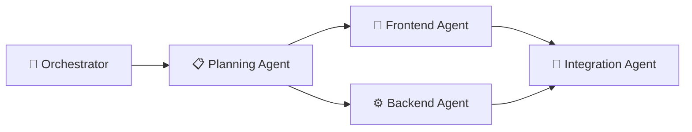

# 🚀 Multi-Agent Todo App — Build Walkthrough

## Project Location
[todo-app](file:///C:/Users/manan/.gemini/antigravity/scratch/todo-app)

---

## Multi-Agent Architecture

Four specialized agents worked together to build this premium Todo application:

| Phase | Agent | Duration | Output |
|-------|-------|----------|--------|
| **Phase 1** | 📋 Planning Agent | Sequential | Folder structure (`assets/`, `css/`, `js/`) |
| **Phase 2** | 🎨 Frontend Agent | ⏐ Parallel | [index.html](file:///C:/Users/manan/.gemini/antigravity/scratch/todo-app/index.html) (245 lines) + [styles.css](file:///C:/Users/manan/.gemini/antigravity/scratch/todo-app/styles.css) (~600 lines) |
| **Phase 2** | ⚙️ Backend Agent | ⏐ Parallel | [script.js](file:///C:/Users/manan/.gemini/antigravity/scratch/todo-app/script.js) (540 lines) |
| **Phase 3** | 🔗 Integration Agent | Sequential | Fixed 13 cross-file issues |

---

## Features Delivered

### ✅ Core Requirements
- **Add tasks** — Form with text input, submit on click or Enter
- **Delete tasks** — Slide-out animation, then removal
- **Mark tasks completed** — Toggle between pending/completed with animation
- **Pending tasks section** — Tab-based UI with empty states
- **Completed tasks section** — Separate tab with clear-all button
- **Task counter** — Live counters for pending, completed, and total

### ✅ Bonus Features
- **🔍 Search tasks** — Real-time filtering with 250ms debounce
- **🎯 Task priority** — Low (🟢), Medium (🟡), High (🔴) color-coded badges
- **🌙 Dark mode** — Default dark theme with light mode toggle, persisted to localStorage
- **📅 Due date** — Date picker with overdue highlighting for past-due tasks

---

## Design Highlights
- **Glassmorphism** — Frosted glass cards with `backdrop-filter: blur`
- **Animated gradient blobs** — Floating background blobs with `blobFloat` keyframes
- **Micro-animations** — Slide-in/out for tasks, shake for validation, pop for counter badge
- **Google Fonts** — Inter with weights 300–800
- **Fully responsive** — Breakpoints at 420px, 640px, 1024px
- **CSS custom properties** — 50+ theme variables for dark/light modes

---

## Integration Fixes Applied (13 total)

> [!IMPORTANT]
> The Integration Agent caught and fixed critical mismatches between independently-built frontend and backend code.

### Critical (5) — Would have broken the app
1. DOM structure: JS built flat divs → Fixed to clone `<template>` element
2. `.task-completed` → `.completed` class name mismatch
3. `.slide-out` → `.deleting` animation class mismatch
4. Button click → `form.submit` event with `preventDefault()`
5. CSS class selectors → `data-priority` attribute selectors

### Major (4) — Would have broken features
6. Tab switching not implemented → Added `switchTab()` function
7. Empty state JS/CSS conflict → Removed JS injection, CSS handles it
8. Clear completed button visibility → Added toggle logic
9. Overdue class applied to wrong element → Fixed target

### Minor (4) — Polish
10. `.input-error` → `.shake` validation animation
11. Theme default alignment (dark mode)
12. Counter badge `.pop` animation trigger
13. `.completing` animation before task move

---

## Agent Reports
- [Backend Agent Report](file:///C:/Users/manan/.gemini/antigravity/brain/5d782483-f9ad-49de-9bf8-ae7c095cb175/backend_agent_report.md)
- [Frontend Agent Report](file:///C:/Users/manan/.gemini/antigravity/brain/5d782483-f9ad-49de-9bf8-ae7c095cb175/frontend_agent_report.md)
- [Integration Agent Report](file:///C:/Users/manan/.gemini/antigravity/brain/5d782483-f9ad-49de-9bf8-ae7c095cb175/integration_agent_report.md)

---

## How to Run
Open [index.html](file:///C:/Users/manan/.gemini/antigravity/scratch/todo-app/index.html) in any modern browser. No build step or server required!

> [!TIP]
> Data persists in `localStorage` — your tasks survive browser refreshes and restarts.
